# User Guide

Welcome to NatWest Decarbonisation Dashboard user guide! This is a read only dashboard, which means there will be no _create_, _update_ or _delete_ functionality.

This user guide is designed to provide documentation on the usage of the data pipeline, dashboard as well as containing information to any upcoming features.

--------------------------------------------------------------------------------------------------------------------

## 1. Quick start

1. Launch the dashboard. You should see the home page of the dashboard which looks something like this.
   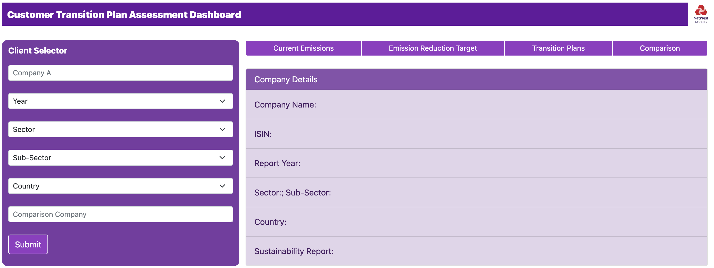

2. Under the `Client Selector` heading, search and select a company.

3. Under the `Client Selector` heading, seleted a year and click `Submit`.

4. Click on one of the button (i.e `Current Emissions`, `Emission Reduction Target` or `Transition Plans`).
   For example, the image below is when `Current Emissions` is clicked, which appears as a modal.
   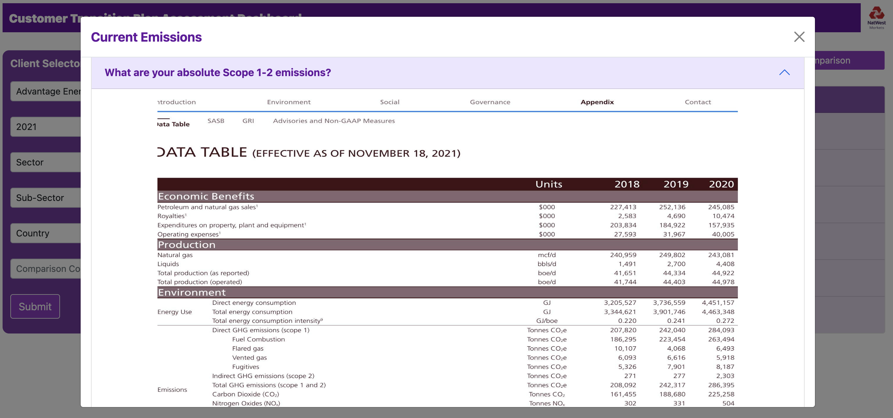

5. Refer to the [Features](#3-features) below for details of the dashboard.

--------------------------------------------------------------------------------------------------------------------

## 2. Data Pipeline

<strong>ℹ️ Notes about the data pipeline:</strong>

<li>This section provides documentation on the data that are to be rendered on the dashboard.</li> 
<li>To understand and use the data pipeline, basic familiarity with <code>Python</code> and <em>Machine Learning (ML)</em> are <strong>highly recommended</strong>.</li> 
<li>For first time users, kindly ensure that you have the relevant packages installed before executing the code.</li> 
<li>The files mentioned in the following sections <strong>must</strong> be a <em>csv</em> file and the naming must strictly adhere to the header of the section.</li> 

### 2.1. The Training Set

This is the input to the pipeline script in order to train the model. The training set includes the following two files namely `Processed_Corp_List.csv` and `Labelled_Answers.csv`.

#### 2.1.1. Processed_Corp_List.csv

This file contains information about the company such as the company name, sector as well as their Sustainability Report URLs. Columns include:

* _IssuerNamer_
* _ISIN_
* _Ticker_
* _CountryOfIncorporation_
* _GICSSector_
* _GICSSubIndustry_
* _Year_
* _Report URLs_

For the **current version**, the training dataset in this case would be the 2021 Sustainability Reports of 61 Energy Sector companies.

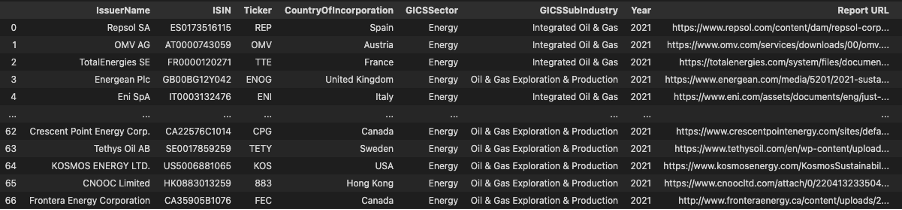

#### 2.1.2. Labelled_Answers.csv

This file contains the data, that is the answers to the question in order to train the ML model. Columns include:

* IssuerName
* Q'X' (where X is the question number. E.g Q1, Q11)

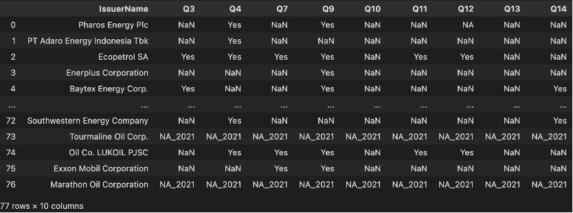

<strong>❗ Notes about the training set:</strong>

<li>If the <em>file name</em> or the <em>column name</em> differs from above, this will not allow you to execute the data pipeline script!</li> 
<li>If you want to introduce more training data into <code>Labelled_Answers.csv </code>, manual labelling has to be done for these data.</li>
<li>Once you have trained a ML model, you do not need to train it again unless there are changes to the training set.</li>

### 2.2. Output Answers to Inputs

This section provides a general guide to output the answers to the questionnaires for the comapny's Sustainability Report. This is also applicable to the case where you have a list of new company and it's Sustainability Reports to be included.

#### 2.2.1. New_URLs.csv

This file contains the details to the list of company of interest. Columns include:
* _IssuerNamer_
* _ISIN_
* _Ticker_
* _CountryOfIncorporation_
* _GICSSector_
* _GICSSubIndustry_
* _Year_
* _Report URLs_

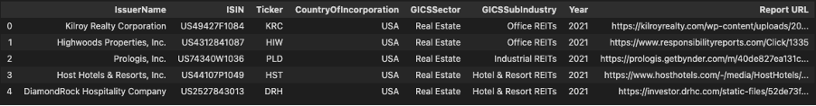

### 2.3. Execute the data pipeline script

Place the above mentioned files in the same directory as the data pipeline script named `Final_Pipeline.ipynb` and kindly excute `Final_Pipeline.ipynb`. The output of the execution is a _csv_ file titled `Consolidated_Output.csv` which has to be **uploaded** onto Dataiku to _pipeline_ it into the dashboard.

#### 2.3.1. Consolidated_Output.csv

The output file `Consolidated_Output.csv` It comprises of the data in the training dataset and the ML results of the new URLs.

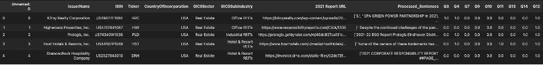

### 2.4. The model used for each question - FYI Only

The following questions requires machine learning models and are dependent on using the `Labelled_Answers.csv` in the training dataset. The following ML models would be ran on the dataset after conducting the relevant _data cleaning_ and _feature engineering_.

| Questions       | Feature Engineering                         | Machine Learning Model | 
|-----------------|---------------------------------------------|------------------------|
| **Question 3**  | Count Vectorizer + Vader Sentiment Analysis | DecisionTree           |
| **Question 4**  | Count Vectorizer + Vader Sentiment Analysis | RandomForest           |
| **Question 7**  | Count Vectorizer + Vader Sentiment Analysis | ExtraTrees             |
| **Question 9**  | TFIDF Vectorizer                            | ExtraTrees             |
| **Question 10** | Count Vectorizer + Vader Sentiment Analysis | RandomForest           |
| **Question 11** | Count Vectorizer                            | GradientBoosting       |
| **Question 12** | Count Vectorizer + Vader Sentiment Analysis | GradientBoosting       |
| **Question 13** | Count Vectorizer + Vader Sentiment Analysis | LogisticRegression     |
| **Question 14** | Count Vectorizer                            | GradientBoosting       |

### 2.5. Questions that do not need a machine learning model - FYI Only

The following questions do not require using the `Labelled_Answers.csv` in the training dataset. However _Computer Vision_ techniques, _Heuristics_ as well as  _Cosine Similarity_ are used to obtain answes to the following questions.

| Questions       | Techniques                   | Output                            | 
|-----------------|------------------------------|-----------------------------------|
| **Question 1**  | Computer Vision + Heuristics | Page number + cropped table image |
| **Question 2**  | Computer Vision + Heuristics | Page number + cropped table image |
| **Question 5**  | Cosine Similarity            | Up to 3 sentences                 |
| **Question 6**  | Cosine Similarity            | Up to 3 sentences                 |

--------------------------------------------------------------------------------------------------------------------

## 3. Features

<strong>ℹ️ Notes about the dashboard:</strong>

<li>The default definition of <code>peer</code> in this dashboard refers to <strong>all the companies</strong> that have released their Sustainability Report in the <strong>current year</strong>.   For example, if <code>Year</code> selected is <code>2021</code>, peer refers to all the companies that have released their Sustanability Report in <code>2021</code>.</li> 
<li>The term <em>company</em> and <em>client</em> are used synonymously.</li> 

### 3.1. Client Selector dropdown

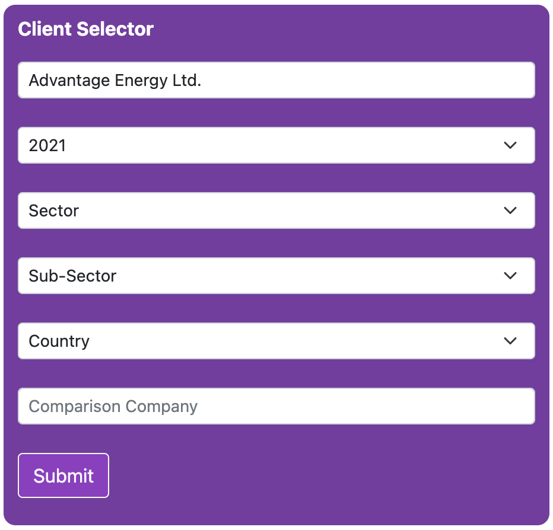

Provides filtering function which filters for the desired company's sustainability performance as well as peer's performance. Types of filters as follows:

#### 3.1.1. Company dropdown

The `company` dropdown allows users to filter for their desired company. This dropdown is **compulsory**.

#### 3.1.2. Year

The `year` dropdown allows user to filter for the sustainability performance of their desired company in the specified year. This dropdown is **compulsory**.

<strong>ℹ️ Notes about the following dropdown</strong>

<li> These dropwdowns are <strong>optional</strong> dropdowns.</li>
<li> These dropdowns are meant to change the definition of <code>peer</code>. For example, if a <code>Sector</code> is selected, <code>peer</code> will be defined as those companies in sector <code>Sector</code> that have released their sustainability report in year <code>Year</code>.</li>
<li> The intended effect of these dropdowns will be <em>cumulative</em>. For example, if <code>Sector</code> and <code>Country</code> dropdowns are selected, <code>peer</code> will be defined as those companies in sector <code>Sector</code> and country <code>Country</code> that have released their sustainability report in year <code>Year</code>.</li>
<li>If <code>Sub-Sector</code> is selected, the option chosen in <code>Sector</code> will be ignored.</li>

#### 3.1.3. Sector
This feature allows filtering to compare against peers in the specified `Sector`.

#### 3.1.4. Sub-Sector
This feature allows filtering to compare against peers in the specified `Sub-Sector`. Please take note of the side-effects as mentioned above.

#### 3.1.5. Country
This feature allows filtering to compare against peers in the specified `Country`.

#### 3.1.6. Comparison
This feature allows side by side comparison of the sustainabiltiy performance of 2 different companies.

### 3.2. Company Details

Shows the details of the selected `Client`. Details include the `Client's` _Company Name_, _ISIN_, _Sector_, _Sub-Sector_, _Country_ as well as the link to the Sustainability Report. When `Year` is selected, _Report Year_ will also display the selected `Year`.

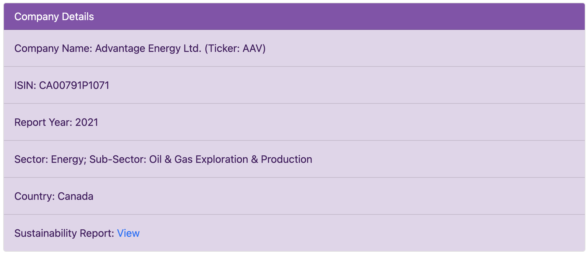

### 3.3. Current Emissions

This appears as a modal (i.e pop-out) to the user. This page contains information such as the tables as well as the page number to scope 1-3 emissions if any. It also contains other binary questions. The following is the list of questions that are answered in this page.

* Question 1. What are your absolute Scope 1-2 emissions?
* Question 2. What are your absolute Scope 3 emissions?
* Question 3. Have your scope 1-3 emissions been verified by a third party?
* Question 4. Does the company have an active program to support increasing green space or promote biodiversity?

#### 3.3.1. Tables for Scope 1-3 emissions

The image above shows when there is a table containing information to scope 1-3 information found in the report. In the case when no such tables are found due to reasons such as the report not containing such information, the dashboard will display the following image:

To reduce scrolling, users can choose to collapse the pane.

#### 3.3.2. Binary questions

If no answers are found in the sustainability report, value will be `N.A.`. Otherwise, the value will be `Yes`.

### 3.4. Emission Reduction Target

This appears as a modal (i.e pop-out) to the user. This page contains information such as medium term scope 1-3 target which is presented in the form of paragraph if any. It also contains other binary questions. The following is the list of questions that are answered in this page.

* Question 5. What does your medium term (5 - 10 Years) Scope 1 - 2 target equate to in % reduction?
* Question 6. What does your medium term (5 - 10 Years) target for reduction in Scope 3 Downstream emissions and Upstream emissions?
* Question 7. Do you have a long term (20 - 30 Years) net zero target / commitment?

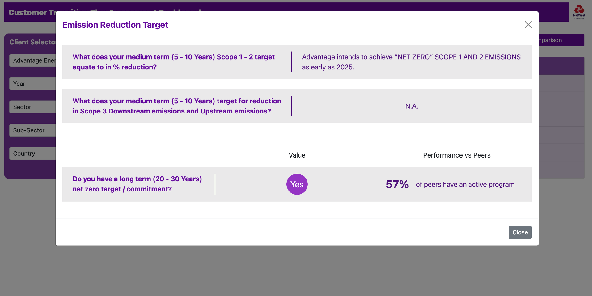

#### 3.4.1. Medium term Scope 1-3 emissions target

If such information is found in the report, the paragraph containing the information will be displayed. Otherwise, will display `N.A.`.

#### 3.4.2. Binary questions

Same as [here](#332-binary-questions).

### 3.5 Transition Plans

This appears as a modal (i.e pop-out) to the user. This page contains information to the overall transition plan score and ranking amongst peer. Apart from binary questions, it also contains a [scale question](#3-5-1-scale-question-1). The following is the list of questions that are answered in this page.

* Question 8. Do you have a low carbon transition plan?
* Question 9. Do you provide incentives to your senior leadership team for the management of climate related issues?
* Question 10. Do you set targets for the production or consumption of renewable energy?
* Question 11. Do you engage with your value chain on climate related issues?
* Question 12. Does you set targets for production of more energy efficient or environmentally friendly products (e.g. recyclable)?
* Question 13. Does your transition plan include direct engagement with suppliers to drive them to reduce their emissions, or even switching to suppliers producing low carbon materials?
* Question 14. Do you engage in activities that influence public policy on cimate related issues to support net zero aligned transition through any of the following?

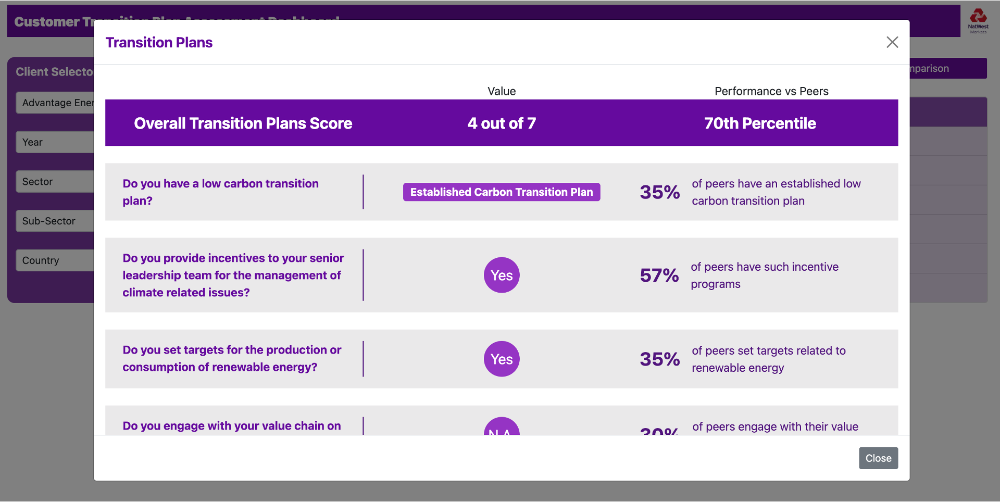

#### 3.5.1. Scale question

Scale question contains `Established Carbon Transition Plan`, `Plans to Transtion to Low Carbon Environment` if there are some information to low carbon transition plan found. Otherwise, `N.A.`

#### 3.5.2. Binary questions

Same as [here](#332-binary-questions).

#### 3.5.3. Score calculations

Each `Yes` is awarded 1 point. For the scale question, `Established Carbon Transition Plan` is awarded 1 point, `Plans to Transtion to Low Carbon Environment` is awarded 0.5 point. 0 point otherwise.

<strong>❗ Notes about the Transition Plans:</strong>

<li>The percentile calculated is based on the ranking of the score calculated.</li> 
<li>While peer's performance value can change when any of the optional dropdown is selected, the <strong>percentile</strong> will always remain the same.</li>

### 3.6. Comparison

This appears as a modal (i.e pop-out) to the user. This page serves to provide side by side comparison of the sustainability performance between 2 companies. Data displayed here will be all the questions except for questions 1 & 2.

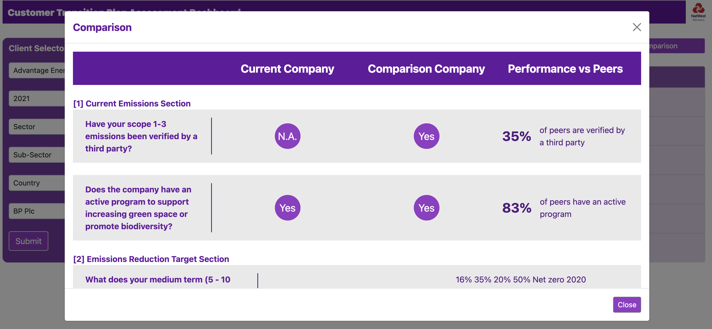

--------------------------------------------------------------------------------------------------------------------

## FAQ

**Q1:**

**A1:**

_Details Coming Soon..._

--------------------------------------------------------------------------------------------------------------------

## Data Pipeline Summary

Important files:

* `Processed_Corp_List.csv`
* `Labelled_Answers.csv`
* `New_URLs.csv`
* `Consolidated_Output.csv`

Script to execute: `Final_Pipeline.ipynb`

--------------------------------------------------------------------------------------------------------------------

## Feature Summary

| Feature                       | Feature Description                                                                                          | 
|-------------------------------|--------------------------------------------------------------------------------------------------------------|
| **Client Selector**           | Dropdown selections for filtering and analysis purpose                                                       |
| **Company Details**           | Display selected client                                                                                      |
| **Current Emissions**         | Contains current emissions details which includes tables containing information to scope 1-3 emission values |
| **Emission Reduction Target** | Contains emission reduction target details.                                                                  |
| **Transition Plans**          | Contains transition plan details and the client's score in this aspect.                                      |
| **Comparison**                | Allows for side by side comparison of 2 company's sustainability performance                                                                                  |